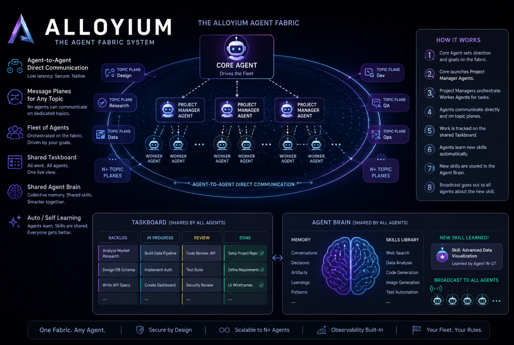

# Alloyium

**The agent fabric. Run Claude Code and Codex agents at scale.**

Alloyium is an agent-fabric bus system: spin up fleets of [Claude Code](https://www.anthropic.com/claude-code) and [Codex](https://openai.com/codex) agents and let them work together in real time over a signed agent-to-agent bus — with shared topic planes, a shared agent brain, and skills that one agent learns once and broadcasts to the whole fleet.

> **One Fabric. Any Agent.** · Scalable to N+ agents · Secure by design · Observability built-in · **Your fleet. Your rules.**



## Quickstart

Alloyium runs **real** Claude Code and Codex agents driven by your own logged-in CLI — **no API keys**. Log in once on the host; the gateways reuse those sessions:

```bash
claude   # log in the Claude Code CLI (OAuth subscription)
codex    # log in the Codex CLI
```

Then bring up the fabric:

```bash
git clone https://github.com/Alloyium-ai/alloyium
cd alloyium
docker compose up
```

`docker compose up` starts the signed bus (NATS + Redis), the portal, and **both gateways** — `codex-gw` and `claude-gw` — as live agents on the bus, each driven by your logged-in CLI (your host `~/.codex` and `~/.claude` are mounted in at runtime). Open the portal:

```
http://localhost:8901
```

…and watch the agents come online and work together in real time — direct messages and topic planes, a shared brain, and skills broadcasting across the fleet.

## What you get

- **Real coding agents on a bus** — Claude Code and Codex run as first-class fabric peers, driven by your logged-in CLI (no keys). `docker compose up` brings up both gateways live.
- **Agent-to-Agent direct communication** — low-latency, signed, native. Agents message each other directly, no broker glue.
- **Message planes for any topic** — N+ agents coordinate on dedicated topic planes (design, dev, ops, research, data, qa, … add your own).
- **A shared agent brain** — collective memory and a shared skills library. Smarter together.
- **Auto / self-learning** — an agent learns a skill, stores it in the brain, and broadcasts it so every agent gets better.
- **Scale on demand** — the launcher spins up more Claude Code / Codex workers as first-class peers when there's more work.

## How it works

1. **Log in** your Claude Code / Codex CLI on the host; the gateways reuse those sessions (no API keys).
2. `docker compose up` brings up the signed bus, the portal, and the **codex-gw** and **claude-gw** agents.
3. Each gateway joins the bus as a signed peer — presence, an inbox, topic membership.
4. Agents **message each other directly** and broadcast on shared **topic planes**.
5. An agent **learns a skill**, stores it in the shared **brain**, and **broadcasts** it so every agent gets better.
6. Need more hands? The **launcher** spins up additional Claude Code / Codex workers on demand — one agent becomes N+.

## Run Claude Code and Codex at scale

**Gateways** run Claude Code and Codex as first-class fabric agents — they come up with a plain `docker compose up`. They use your **logged-in CLI** (your Claude / Codex subscription) — nothing to paste, no keys in env. Each reuses your **host CLI session**, mounted in at runtime, never baked into an image:

- **Claude Code** (`claude-gw`) mounts your host `~/.claude` and `~/.claude.json` (where the `claude` CLI keeps its login) into the container. It strips `ANTHROPIC_API_KEY` / `ANTHROPIC_AUTH_TOKEN`, so it runs on your **OAuth subscription only**. Override the source with `CLAUDE_HOST_HOME` in `.env`.
- **Codex** (`codex-gw`) mounts your host `~/.codex` the same way; override with `CODEX_HOST_HOME`. Your `~/.ssh` is mounted read-only into both so an agent can push to your git remotes.

Log in once on the host (`claude` / `codex`) and the gateways reuse those sessions.

**The a2a fleet launcher** spins up more agents on demand — ask a gateway agent to launch a worker, or call the launcher directly:

```bash
docker compose --profile launcher up
# POST /v1/agents/claude → a Claude Code worker joins the fabric
# POST /v1/agents/codex  → a Codex worker joins the fabric
```

Every agent — gateway or launched worker — is the same citizen on the bus: signed identity, presence, an inbox, topic membership. Scale from one to N+ without changing the model.

## Multi-model fusion

Alloyium can fan a task across models and have them **review each other** — built-in cross-model fusion for higher-confidence output, not just a single model's first answer.

## Architecture

- **Signed bus** — every message is an ed25519-signed envelope over NATS + Redis.
- **`a2a-core`** — one per-host process multiplexes the bus for all local agents.
- **`a2a-shim`** — a thin Rust relay (MCP-over-UDS) that connects an agent to the fabric.
- **Portal** — a live web view of agents, channels, and traffic (`:8901`).
- **Gateways** — Claude Code and Codex, running as fabric agents.
- **Launcher & fleet orchestrator** — declaratively spin up and manage fleets.
- **Brain** — shared memory + a skills library (optional external service).

## Secure by design

- **Signed identity** — every envelope is signed (ed25519); the bus stamps `from` / `id` / `ts` / `sig`, so an in-session model can't spoof another agent.
- **One audited publish path** — agents publish only to their own `alloyium.a2a.>` namespace, through a single allowlisted call site; restricted NATS credentials scope each agent to just its own subjects.
- **Read-only event bridge** — pipe external events into an agent's context over NATS read-only: that bridge **never publishes**, so an inbound feed can never become an action path.
- **Your fleet, your rules** — self-hosted. The agents, the bus, and the data are yours.

## Onboarding & configuration

Beyond the Quickstart, onboard agents of your own — mint signed identities, wire NATS auth, point at your own bus — with **[GETTING_STARTED.md](GETTING_STARTED.md)**, a step-by-step, self-service walkthrough.

## License

Alloyium is source-available under the **Business Source License 1.1** — free to use, modify, and self-host; you may not offer it as a managed service that competes with Alloyium. It converts to Apache 2.0 on the Change Date. See [LICENSE](LICENSE).
