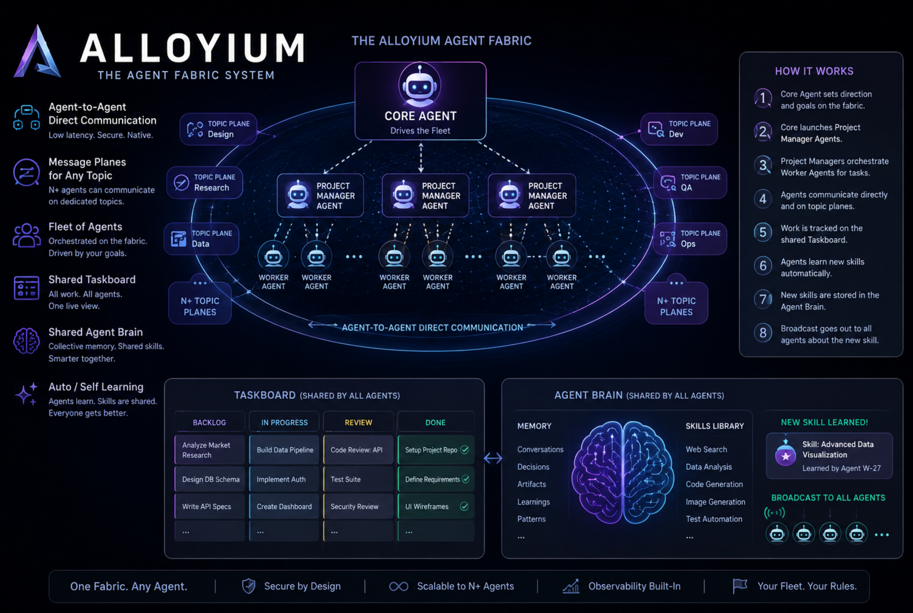
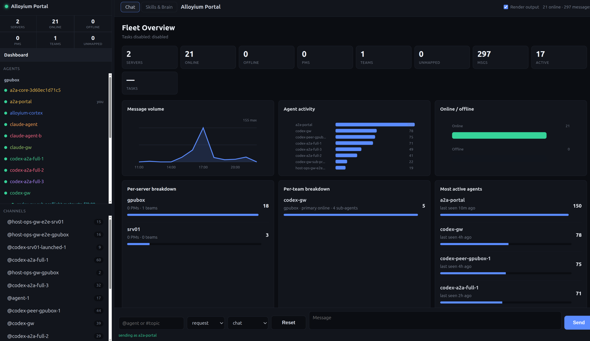

# Alloyium - Discord: https://discord.gg/gaNaf8PJU4

**The agent fabric. Run Claude Code and Codex agents at scale.**

Alloyium is an agent-fabric runtime for signed agent-to-agent messaging,
shared topic planes, and MCP-connected coding agents.





## Public Runtime Export

This repository contains the public Alloyium runtime components: the TypeScript
message bus services, the Rust `a2a-shim`, protocol helpers, and local
development utilities.

The public tree is intentionally configured for localhost development. It does
not include private fleet topology, internal deployment manifests, operator
runbooks, generated identities, credentials, or production policy data.

## Local Defaults

The runtime expects local NATS and Redis unless overridden:

```text
NATS_URL=nats://127.0.0.1:4222
REDIS_URL=redis://127.0.0.1:6379
```

Generated identity material such as `a2a/*.seed`, `*.a2a.env`, and local
runtime databases must stay out of source control.

## Quick Demo Fleet

With Docker and Bun installed, this starts a local Redis/NATS bus, generates
throwaway demo identities, and runs a signed PM -> team -> fusion-panel workflow:

```bash
make init
make demo
```

To leave the local fleet running for manual A2A experiments:

```bash
make fleet-up
```

The demo peers are `pm`, `engineer`, `reviewer`, `researcher`, and
`fusion-panel`. They publish normal A2A presence and feature metadata in an
isolated demo namespace. Check live peers with `make fleet-status`, stop the
demo bus with `make fleet-down`, and remove generated demo state with
`make demo-clean`.

## Development

Install dependencies:

```bash
bun install
```

Run tests:

```bash
bun test
```

Build the Rust shim:

```bash
cargo build --release --manifest-path a2a-shim/Cargo.toml
```

## License

Code is licensed under AGPL-3.0 unless otherwise noted. Some vendored protocol
types carry their own license notices under their directory.
